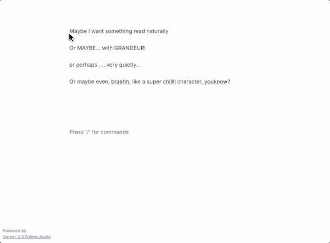

# Voice Cursor

An experimental text editor showcasing Gemini 2.0's Native Audio capabilities. Built on top of [Novel](https://novel.sh), Voice Cursor demonstrates how Gemini's new text-to-speech API can be integrated into a text editor for fluid, in context voice generation.



## What is Gemini 2.0 Native Audio?

Gemini 2.0 introduces multilingual native audio output - a powerful new capability that lets developers generate natural-sounding speech directly from the Gemini API. This project demonstrates how to use this feature in a real application.

🎥 [Watch the Gemini 2.0 Native Audio Demo](https://www.youtube.com/watch?v=qE673AY-WEI) 🔊

## Features

- 🎯 **Native Gemini Audio**: Direct integration with Gemini 2.0's text-to-speech capabilities
- 🎭 **Rich Voice Options**: 8 different Gemini voices with distinct characteristics
- 😊 **Emotional Control**: 15 different tones to shape how Gemini expresses the text
- 🎨 **Visual Integration**: Color-coded highlights show which voice and tone were used
- ⚡ **Instant Generation**: Quick audio synthesis powered by Gemini's latest model

## Getting Started

### 1. Clone this repository and install dependencies:

```bash
git clone https://github.com/googlecreativelab/gemini-demos/voice-cursor
```

```bash
npm install
```

### 2. Create a `.env.local` file with your AI Studio API key:

Get your API key from [Google AI Studio](https://aistudio.google.com/apikey)

```env
NEXT_PUBLIC_GEMINI_API_KEY=your_api_key_here
```

### 3. Start the development server:

```bash
npm run dev
```

Open [http://localhost:3000](http://localhost:3000) and start highlighting text!

## How It Works

The magic happens in [`src/components/editor/selectors/voice-popover.tsx`](src/components/editor/selectors/voice-popover.tsx). When text is highlighted, we construct a prompt that includes both the text and desired emotional tone:

This is then sent to Gemini 2.0's API with audio generation enabled.

### Tone Options

The voice cursor supports various emotional tones through the [`src/lib/tone-options.ts`](src/lib/tone-options.ts) file. Each tone has an emoji and a transformation function that constructs the prompt:

Edit, add, or remove tones in [`src/lib/tone-options.ts`](src/lib/tone-options.ts):
```typescript
export const TONE_OPTIONS: ToneOption[] = [
    // How are you feeling?
    // --> Prompt transformation -->
    // Say rapidly and energetically: "How-are-you-feeling?"
    { 
        emoji: "🐰", 
        name: "Fast",
        transform: (text) => `Say rapidly and energetically: "${text.split(' ').join('-')}"`
    },
];
```

Then that tone is used in the [`src/components/editor/selectors/voice-popover.tsx`](src/components/editor/selectors/voice-popover.tsx) file where we make a request to Gemini 2.0 Native Audio:

```typescript
const response = await fetch(
    `https://generativelanguage.googleapis.com/v1beta/models/gemini-2.0-flash-exp:generateContent?key=${process.env.NEXT_PUBLIC_GEMINI_API_KEY}`,
    {
        method: "POST",
        headers: {
            "Content-Type": "application/json",
        },
        body: JSON.stringify({
            contents: [{
                parts: [{ text: textToSpeak }]
            }],
            generationConfig: {
                response_modalities: ["AUDIO"],
                speech_config: {
                    voice_config: {
                        prebuilt_voice_config: {
                            voice_name: voice
                        }
                    }
                }
            }
        })
    }
);
```


## Try Gemini 2.0 Native Audio


You can experiment with Gemini 2.0's in AI Studio:

1. Visit [AI Studio](https://aistudio.google.com/app/)
2. Select "Gemini 2.0 Flash Experimental" model
3. Set output format to "Audio"
4. Enter your prompt
5. Click "Generate"


## Credits

- Built with [Novel](https://novel.sh), a Notion-style WYSIWYG editor
- Powered by [Google's Gemini 2.0](https://blog.google/products/gemini/google-gemini-ai-collection-2024/) Native Audio
- Code from [Trudy Painter](https://www.trudy.computer), [@trudypainter](https://github.com/trudypainter)
- Design from [Jose Guizar](https://joseguizar.com/)

## Disclaimer

This is an experiment showcasing Gemini 2.0's Native Audio capabilities, not an official Google product. We'll do our best to support and maintain this experiment but your mileage may vary.
We encourage open sourcing projects as a way of learning from each other. Please respect our and other creators' rights, including copyright and trademark rights when present, when sharing these works and creating derivative work. If you want more info on Google's policy, you can find that [here](https://developers.google.com/terms/site-policies).

## License

Licensed under the Apache-2.0 license.
